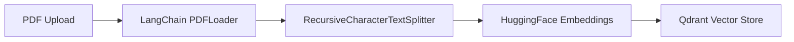
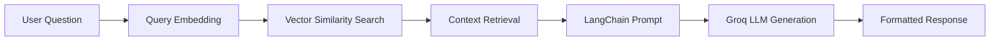

# 🦜 LangChain RAG Assistant - Chat with Your Documents

A modern **Retrieval-Augmented Generation (RAG)** chatbot built with **LangChain** that allows you to upload PDF documents and have intelligent conversations about their content. Features a ChatGPT-like interface powered by Groq's LLaMA 3.1 70B model, Qdrant vector database, and HuggingFace embeddings.

## 🌟 Features

### Core RAG Functionality
- **📄 PDF Document Processing**: Upload PDFs up to 10MB with LangChain PDFLoader
- **🧠 Intelligent Chat Interface**: ChatGPT-like conversational experience
- **🔍 Vector-Based Search**: Semantic similarity search using HuggingFace embeddings
- **🎯 Context-Aware Responses**: LLM responses use both document context and general knowledge
- **📚 Source Citation**: Automatic citation of relevant document sections
- **⚡ Real-time Processing**: Instant document chunking and vector storage

### Modern UI/UX Features
- **� Fully Responsive Design**: Seamless experience on desktop, tablet, and mobile
- **🎨 ChatGPT-like Interface**: Modern chat bubbles, avatars, and smooth animations
- **📋 Smart Sidebar**: Collapsible document upload panel with conditional scrolling
- **� Mobile Optimization**: Fullscreen mobile sidebar with smooth open/close animations
- **� Live Status Indicators**: Real-time connection status for LLM and vector database
- **⚡ Instant Upload Feedback**: Drag-and-drop with live processing status

### Technical Features
- **🦜 Pure LangChain Implementation**: Complete RAG pipeline using LangChain framework
- **🚀 High-Performance Backend**: Express.js API with async document processing
- **🔒 Type-Safe Frontend**: Full TypeScript support with Next.js 14
- **🎯 Smart Query Enhancement**: Automatic query classification and enhancement
- **📈 Optimized Chunking**: Intelligent text splitting with overlap for better context

## 🏗️ Architecture

```
┌─────────────────┐    ┌─────────────────┐    ┌─────────────────┐
│   Frontend      │    │    Backend      │    │   External      │
│   (Next.js)     │    │   (Express.js)  │    │   Services      │
├─────────────────┤    ├─────────────────┤    ├─────────────────┤
│ • ChatInterface │◄──►│ • LangChain     │◄──►│ • Groq API      │
│ • ChatArea      │    │   RAG Service   │    │   (LLaMA 3.1)   │
│ • FileUpload    │    │ • Chat Routes   │    │                 │
│ • UploadStatus  │    │ • Upload Routes │    │ • Qdrant Cloud  │
└─────────────────┘    └─────────────────┘    │   (Vector DB)   │
                                              │                 │
                                              │ • HuggingFace   │
                                              │   (Embeddings)  │
                                              └─────────────────┘
```

## 🛠️ Technology Stack

### Backend (LangChain RAG Pipeline)
- **Node.js + Express.js**: RESTful API server
- **LangChain**: Complete RAG framework with advanced document processing
- **Groq API**: LLaMA 3.1 70B model for high-speed text generation
- **Qdrant Cloud**: Production-ready vector database for embeddings
- **HuggingFace Transformers**: MiniLM-L6-v2 embeddings (384 dimensions)
- **LangChain PDFLoader**: Advanced PDF text extraction and processing
- **RecursiveCharacterTextSplitter**: Intelligent document chunking

### Frontend (Modern React Application)
- **Next.js 14**: React framework with App Router and TypeScript
- **Tailwind CSS**: Utility-first CSS framework for responsive design
- **Heroicons**: Beautiful SVG icons for modern UI components
- **React Hooks**: Advanced state management and side effects

### AI/ML Pipeline
- **Vector Embeddings**: 384-dimensional semantic representations
- **Semantic Search**: Cosine similarity matching for document retrieval
- **Prompt Engineering**: Custom prompt templates for optimal responses
- **Query Enhancement**: Intelligent query classification and expansion
- **Context Integration**: Seamless blending of document and general knowledge

## 📋 Prerequisites

- **Node.js** (v18 or higher)
- **npm** or **yarn**
- **Groq API Key** ([Get one here](https://console.groq.com/))
- **Qdrant Cloud Account** ([Sign up here](https://cloud.qdrant.io/))

## 🚀 Quick Start

### 1. Clone the Repository

```bash
git clone <your-repo-url>
cd rag-chatbot
```

### 2. Backend Setup

```bash
cd backend
npm install
```

Create a `.env` file in the backend directory:

```env
# Groq API Configuration
GROQ_API_KEY=your_groq_api_key_here

# Qdrant Configuration
QDRANT_API_URL=https://your-qdrant-cluster.qdrant.io:6333
QDRANT_API_KEY=your_qdrant_api_key_here

# Server Configuration
PORT=3001
```

Start the backend server:

```bash
npm start
```

The backend will be available at `http://localhost:3001`

### 3. Frontend Setup

```bash
cd ../frontend
npm install
npm run dev
```

The frontend will be available at `http://localhost:3000`

## 📁 Project Structure

```
rag-chatbot/
├── backend/
│   ├── .env                            # Environment variables
│   ├── package.json                    # Backend dependencies
│   ├── server.js                       # Express server entry point
│   ├── routes/
│   │   ├── chat.js                     # LangChain chat endpoints
│   │   └── upload.js                   # PDF upload endpoints
│   └── services/
│       └── langchainRAGService.js      # Complete LangChain RAG pipeline
├── frontend/
│   ├── package.json                    # Frontend dependencies
│   ├── next.config.ts                  # Next.js configuration
│   ├── tailwind.config.ts              # Tailwind CSS config
│   ├── src/
│   │   ├── app/
│   │   │   ├── layout.tsx              # Root layout with metadata
│   │   │   ├── page.tsx                # Home page
│   │   │   └── globals.css             # Global styles
│   │   └── components/
│   │       ├── ChatInterface.tsx       # Main chat interface with sidebar
│   │       ├── ChatArea.tsx            # Chat messages with mobile optimization
│   │       ├── FileUpload.tsx          # PDF upload with drag-and-drop
│   │       └── UploadStatus.tsx        # Document status with smart scrolling
└── README.md                           # This file
```

## 🔧 API Endpoints

### Chat Endpoints

#### `POST /chat`
Chat with uploaded documents using LangChain RAG pipeline

**Request:**
```json
{
  "question": "What are the main topics covered in the document?"
}
```

**Response:**
```json
{
  "answer": "Based on the uploaded documents, the main topics include:\n\n1. Topic 1\n2. Topic 2\n\n🦜 **Powered by LangChain RAG** | Groq LLaMA 3.1 70B + Qdrant Vector Store"
}
```

### Upload Endpoints

#### `POST /upload`
Upload a PDF document for processing with LangChain

**Request:** `multipart/form-data` with `pdf` field

**Response:**
```json
{
  "success": true,
  "message": "PDF uploaded and processed successfully with LangChain",
  "data": {
    "filename": "document.pdf",
    "chunks_count": 15,
    "total_characters": 12450
  }
}
```

#### `GET /upload/status`
Check LangChain upload service status

**Response:**
```json
{
  "message": "LangChain upload service is running",
  "supported_formats": ["PDF"],
  "max_file_size": "10MB",
  "processing_method": "LangChain PDFLoader + RecursiveCharacterTextSplitter",
  "vector_store": "Qdrant",
  "embeddings": "HuggingFace MiniLM-L6-v2"
}
```

## 🧠 How It Works

### 1. Document Processing Pipeline (LangChain)



1. **PDF Upload**: User uploads a PDF file via the modern drag-and-drop interface
2. **LangChain PDFLoader**: Advanced PDF text extraction with metadata preservation
3. **Text Splitting**: RecursiveCharacterTextSplitter creates optimal chunks with overlap
4. **Generate Embeddings**: HuggingFace MiniLM-L6-v2 creates 384-dimensional vectors
5. **Vector Storage**: Store in Qdrant cloud with automatic indexing

### 2. Question Answering Pipeline (LangChain RAG)



1. **Query Processing**: Convert user question to embedding vector
2. **Semantic Search**: Find most relevant document chunks using cosine similarity
3. **Context Preparation**: Gather top-K similar chunks with source metadata
4. **Prompt Engineering**: Use custom LangChain prompt template for optimal responses
5. **LLM Generation**: Groq LLaMA 3.1 70B generates contextual answer
6. **Response Formatting**: Combine document context with general knowledge

## ⚙️ Configuration

### Environment Variables

| Variable | Description | Required |
|----------|-------------|----------|
| `GROQ_API_KEY` | Groq API key for LLaMA 3.1 70B access | ✅ Yes |
| `QDRANT_API_URL` | Qdrant cloud cluster URL | ✅ Yes |
| `QDRANT_API_KEY` | Qdrant cloud API key | ✅ Yes |
| `PORT` | Backend server port | ❌ No (default: 3001) |

### LangChain Configuration Options

#### Document Chunking (in `langchainRAGService.js`)
```javascript
const textSplitter = new RecursiveCharacterTextSplitter({
  chunkSize: 1000,        // Characters per chunk
  chunkOverlap: 200,      // Overlap between chunks
});
```

#### Vector Search Parameters
```javascript
retriever = vectorStore.asRetriever({
  k: 5,                   // Number of similar chunks to retrieve
});
```

#### LLM Parameters
```javascript
llm = new ChatGroq({
  model: "llama3-70b-8192",
  temperature: 0.3,       // Lower = more focused responses
  maxTokens: 1000,        // Maximum response length
});
```

#### Embedding Model
```javascript
embeddings = new HuggingFaceTransformersEmbeddings({
  modelName: "Xenova/all-MiniLM-L6-v2",  // 384-dimensional embeddings
});
```

## 🚀 Deployment

### Backend Deployment

1. **Environment Setup**: Ensure all environment variables are set
2. **Dependencies**: Run `npm install --production`
3. **Start Server**: Use `npm start` or process manager like PM2

### Frontend Deployment

1. **Build**: Run `npm run build`
2. **Start**: Run `npm start` or deploy to platforms like Vercel

### Recommended Platforms

- **Backend**: Railway, Render, DigitalOcean
- **Frontend**: Vercel, Netlify
- **Vector DB**: Qdrant Cloud (already configured)

## 🧪 Testing

### Manual Testing

1. **Start both servers** (backend on :3001, frontend on :3000)
2. **Upload a PDF** using the modern drag-and-drop interface
3. **Ask questions** about the document content in the ChatGPT-like interface
4. **Test mobile responsiveness** with the fullscreen sidebar
5. **Verify LangChain processing** in console logs

### API Testing

```bash
# Test upload service status
curl -X GET http://localhost:3001/upload/status

# Test document upload
curl -X POST http://localhost:3001/upload \
  -F "pdf=@your_document.pdf"

# Test chat with LangChain
curl -X POST http://localhost:3001/chat \
  -H "Content-Type: application/json" \
  -d '{"question": "What is this document about?"}'
```

### LangChain Debug Mode

Enable detailed logging in `langchainRAGService.js`:

```javascript
console.log('📊 Query embedding:', queryEmbedding.slice(0, 5));
console.log('🔍 Retrieved chunks:', retrievedDocs.length);
console.log('🤖 LLM response:', result);
```

## 🔍 Troubleshooting

### Common Issues

#### 1. "API Key not found" Error
- Verify `.env` file exists in backend directory
- Check that `GROQ_API_KEY` is set correctly
- Restart the backend server

#### 2. Qdrant Vector Database Connection Error
- Verify Qdrant URL format: `https://cluster-id.region.aws.cloud.qdrant.io:6333`
- Check Qdrant API key is valid and active
- Ensure Qdrant cluster is running (check Qdrant cloud dashboard)

#### 3. PDF Upload Fails
- Check file size (max 10MB)
- Ensure file is a valid PDF with extractable text
- Verify LangChain PDFLoader initialization in console

#### 4. No Relevant Context Found
- Upload more documents or larger documents
- Try rephrasing your question
- Check LangChain vector search in console logs

#### 5. Frontend Build Issues
- Clear Next.js cache: `rm -rf .next`
- Reinstall dependencies: `npm install`
- Check TypeScript compilation errors

### LangChain Debug Mode

Enable detailed logging by setting environment variable:

```bash
export LANGCHAIN_VERBOSE=true
```

Or add console logs in `langchainRAGService.js`:

```javascript
console.log('🦜 LangChain retriever results:', retrievedDocs);
console.log('🤖 Groq LLM input:', prompt);
console.log('✅ Final response:', formattedResponse);
```

## 🚧 Current Implementation

### What's Implemented ✅
- **Pure LangChain RAG Pipeline**: Complete document processing and retrieval system
- **Modern ChatGPT-like UI**: Responsive design with mobile fullscreen sidebar
- **PDF Processing**: LangChain PDFLoader with RecursiveCharacterTextSplitter
- **Vector Search**: HuggingFace embeddings with Qdrant vector database
- **Smart Responses**: Context-aware answers using document and general knowledge
- **Mobile Optimization**: Fullscreen sidebar with smooth animations
- **Real-time Status**: Live connection indicators for services
- **TypeScript Frontend**: Type-safe React components with Next.js 14

### Technical Architecture
- **Backend**: Express.js with single LangChain service
- **Frontend**: Next.js 14 with modern component architecture
- **Database**: Qdrant cloud vector storage
- **AI**: Groq LLaMA 3.1 70B with HuggingFace embeddings

## 🛣️ Future Enhancements

### Planned Features
- [ ] Support for DOCX, TXT, and Markdown files
- [ ] User authentication and session management
- [ ] Document summarization with LangChain
- [ ] Conversation history persistence
- [ ] Multi-language support
- [ ] Advanced search filters and faceting
- [ ] Document versioning and updates
- [ ] Batch document upload
- [ ] Custom embedding model selection

### UI/UX Improvements
- [ ] Dark mode toggle
- [ ] Customizable chat themes
- [ ] Advanced document preview
- [ ] Export conversations to PDF/Markdown
- [ ] Keyboard shortcuts
- [ ] Voice input/output
- [ ] Document highlighting and annotations

### Technical Improvements
- [ ] Redis caching layer for embeddings
- [ ] Database persistence for chat history
- [ ] Advanced LangChain memory management
- [ ] Custom prompt template editor
- [ ] API rate limiting and monitoring
- [ ] Performance analytics dashboard
- [ ] Automated testing suite

## 🙏 Acknowledgments

- **LangChain** for the comprehensive RAG framework and document processing tools
- **Groq** for providing ultra-fast LLaMA 3.1 70B inference
- **Qdrant** for production-ready vector database services
- **HuggingFace** for high-quality embedding models and transformers
- **Vercel** for Next.js framework and deployment platform
- **Tailwind CSS** for utility-first styling and responsive design

---

**Built with 🦜 LangChain for intelligent document interaction**
