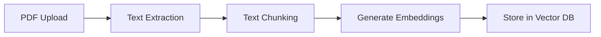
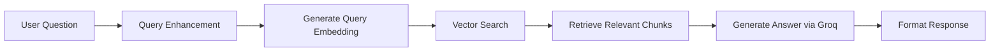

# 📚 RAG Chatbot - Chat with Your Documents

A sophisticated **Retrieval-Augmented Generation (RAG)** chatbot that allows you to upload PDF documents and have intelligent conversations about their content. Built with Node.js, Express, Next.js, and powered by Groq's LLaMA 3.1 model.

## 🌟 Features

### Core Functionality
- **📄 PDF Upload & Processing**: Upload PDF documents up to 10MB
- **🧠 Smart Document Chat**: Ask questions about your uploaded documents
- **🔍 Intelligent Text Chunking**: Automatic text segmentation with overlap for better context
- **🎯 Semantic Search**: Vector-based similarity search using local embeddings
- **📝 Source Citation**: Answers include references to source documents
- **💬 Conversation Memory**: Maintains context across chat sessions

### AI-Powered Features
- **🔄 Query Enhancement**: Automatically improves and expands user queries
- **📊 Query Classification**: Categorizes questions (definition, how-to, explanation, etc.)
- **🎨 Smart Response Formatting**: Tailored responses based on query type
- **🔗 Related Questions**: Suggests related questions from conversation history
- **📚 Context-Aware Responses**: Uses conversation history for better answers

### Technical Features
- **🌐 Modern Web Interface**: Responsive React/Next.js frontend with Tailwind CSS
- **🚀 High-Performance Backend**: Express.js API with async processing
- **🔒 Type-Safe**: Full TypeScript support in frontend
- **📱 Mobile Responsive**: Works seamlessly on desktop, tablet, and mobile
- **⚡ Real-time Updates**: Instant chat responses and upload status

## 🏗️ Architecture

```
┌─────────────────┐    ┌─────────────────┐    ┌─────────────────┐
│   Frontend      │    │    Backend      │    │   External      │
│   (Next.js)     │    │   (Express.js)  │    │   Services      │
├─────────────────┤    ├─────────────────┤    ├─────────────────┤
│ • ChatInterface │◄──►│ • Chat Routes   │◄──►│ • Groq API      │
│ • FileUpload    │    │ • Upload Routes │    │   (LLaMA 3.1)   │
│ • ChatArea      │    │ • PDF Service   │    │                 │
│ • UploadStatus  │    │ • RAG Pipeline  │    │ • Qdrant Cloud  │
└─────────────────┘    └─────────────────┘    │   (Vector DB)   │
                                              │                 │
                                              │ • @xenova/      │
                                              │   transformers  │
                                              │   (Embeddings)  │
                                              └─────────────────┘
```

## 🛠️ Technology Stack

### Backend
- **Node.js + Express.js**: RESTful API server
- **Groq API**: LLaMA 3.1 70B model for text generation
- **Qdrant Cloud**: Vector database for document embeddings
- **@xenova/transformers**: Local embeddings (MiniLM-L6-v2, 384d)
- **pdf-parse**: PDF text extraction
- **Multer**: File upload handling

### Frontend
- **Next.js 14**: React framework with App Router
- **TypeScript**: Type-safe development
- **Tailwind CSS**: Utility-first styling
- **React Hooks**: State management

### AI/ML Components
- **Vector Embeddings**: 384-dimensional embeddings using MiniLM
- **Semantic Search**: Cosine similarity matching
- **Text Chunking**: Intelligent document segmentation
- **Query Enhancement**: Natural language processing
- **Response Formatting**: Context-aware answer generation

## 📋 Prerequisites

- **Node.js** (v18 or higher)
- **npm** or **yarn**
- **Groq API Key** ([Get one here](https://console.groq.com/))
- **Qdrant Cloud Account** ([Sign up here](https://cloud.qdrant.io/))

## 🚀 Quick Start

### 1. Clone the Repository

```bash
git clone <your-repo-url>
cd rag-chatbot
```

### 2. Backend Setup

```bash
cd backend
npm install
```

Create a `.env` file in the backend directory:

```env
# Groq API Configuration
GROQ_API_KEY=your_groq_api_key_here

# Qdrant Configuration
QDRANT_API_URL=https://your-qdrant-cluster.qdrant.io:6333
QDRANT_API_KEY=your_qdrant_api_key_here

# Server Configuration
PORT=3001
```

Start the backend server:

```bash
npm start
```

The backend will be available at `http://localhost:3001`

### 3. Frontend Setup

```bash
cd ../frontend
npm install
npm run dev
```

The frontend will be available at `http://localhost:3000`

## 📁 Project Structure

```
rag-chatbot/
├── backend/
│   ├── .env                      # Environment variables
│   ├── package.json              # Backend dependencies
│   ├── server.js                 # Express server entry point
│   ├── routes/
│   │   ├── chat.js              # Chat API endpoints
│   │   └── upload.js            # File upload endpoints
│   ├── services/
│   │   ├── groqClient.js        # Groq API integration
│   │   ├── vectorStoreService.js # Qdrant vector database
│   │   ├── embeddingService.js   # Local embeddings
│   │   ├── pdfService.js        # PDF processing
│   │   ├── queryEnhancementService.js # Query improvement
│   │   ├── conversationService.js     # Chat history
│   │   └── responseService.js   # Response formatting
│   └── test/
│       └── data/                # Test files
├── frontend/
│   ├── package.json             # Frontend dependencies
│   ├── next.config.ts           # Next.js configuration
│   ├── tailwind.config.ts       # Tailwind CSS config
│   ├── src/
│   │   ├── app/
│   │   │   ├── layout.tsx       # Root layout
│   │   │   ├── page.tsx         # Home page
│   │   │   └── globals.css      # Global styles
│   │   └── components/
│   │       ├── ChatInterface.tsx # Main chat component
│   │       ├── ChatArea.tsx     # Chat messages display
│   │       ├── FileUpload.tsx   # PDF upload component
│   │       └── UploadStatus.tsx # Upload status display
└── README.md                    # This file
```

## 🔧 API Endpoints

### Chat Endpoints

#### `POST /chat`
Chat with uploaded documents

**Request:**
```json
{
  "question": "What are the main topics covered in the document?"
}
```

**Response:**
```json
{
  "answer": "Based on the uploaded documents, the main topics include:\n\n1. Topic 1\n2. Topic 2\n\n**Sources:**\n1. document.pdf"
}
```

### Upload Endpoints

#### `POST /upload`
Upload a PDF document

**Request:** `multipart/form-data` with `pdf` field

**Response:**
```json
{
  "success": true,
  "message": "PDF uploaded and processed successfully",
  "data": {
    "filename": "document.pdf",
    "chunks_count": 15,
    "total_characters": 12450
  }
}
```

#### `GET /upload/status`
Check upload service status

**Response:**
```json
{
  "message": "Upload service is running",
  "supported_formats": ["PDF"],
  "max_file_size": "10MB"
}
```

## 🧠 How It Works

### 1. Document Processing Pipeline



1. **PDF Upload**: User uploads a PDF file
2. **Text Extraction**: Extract text using pdf-parse
3. **Text Chunking**: Split text into 1000-character chunks with 200-character overlap
4. **Generate Embeddings**: Create 384-dimensional vectors using MiniLM
5. **Store in Vector DB**: Save chunks and embeddings in Qdrant

### 2. Question Answering Pipeline



1. **Query Enhancement**: Improve and classify the user's question
2. **Generate Embedding**: Convert question to vector representation
3. **Vector Search**: Find most similar document chunks using cosine similarity
4. **Context Preparation**: Prepare relevant chunks with source information
5. **AI Generation**: Use Groq's LLaMA 3.1 to generate contextual answer
6. **Response Formatting**: Format answer with sources and related questions

## ⚙️ Configuration

### Environment Variables

| Variable | Description | Required |
|----------|-------------|----------|
| `GROQ_API_KEY` | Groq API key for LLaMA access | ✅ Yes |
| `QDRANT_API_URL` | Qdrant cluster URL | ✅ Yes |
| `QDRANT_API_KEY` | Qdrant API key | ✅ Yes |
| `PORT` | Backend server port | ❌ No (default: 3001) |

### Customization Options

#### Chunking Parameters
In `pdfService.js`:
```javascript
function chunkText(text, chunkSize = 1000, overlap = 200)
```

#### Search Parameters
In `groqClient.js`:
```javascript
const similarChunks = await getSimilarChunks(queryEmbedding, 5); // Number of chunks
```

#### Model Parameters
In `groqClient.js`:
```javascript
{
  model: 'llama3-70b-8192',
  temperature: 0.3,        // Lower = more focused
  max_tokens: 1000,        // Response length
}
```

## 🚀 Deployment

### Backend Deployment

1. **Environment Setup**: Ensure all environment variables are set
2. **Dependencies**: Run `npm install --production`
3. **Start Server**: Use `npm start` or process manager like PM2

### Frontend Deployment

1. **Build**: Run `npm run build`
2. **Start**: Run `npm start` or deploy to platforms like Vercel

### Recommended Platforms

- **Backend**: Railway, Render, DigitalOcean
- **Frontend**: Vercel, Netlify
- **Vector DB**: Qdrant Cloud (already configured)

## 🧪 Testing

### Manual Testing

1. **Start both servers** (backend on :3001, frontend on :3000)
2. **Upload a PDF** through the web interface
3. **Ask questions** about the document content
4. **Verify sources** are properly cited in responses

### API Testing

```bash
# Test upload endpoint
curl -X POST http://localhost:3001/upload/status

# Test chat endpoint
curl -X POST http://localhost:3001/chat \
  -H "Content-Type: application/json" \
  -d '{"question": "What is this document about?"}'
```

## 🔍 Troubleshooting

### Common Issues

#### 1. "API Key not found" Error
- Verify `.env` file exists in backend directory
- Check that `GROQ_API_KEY` is set correctly
- Restart the backend server

#### 2. Vector Database Connection Error
- Verify Qdrant URL format: `https://cluster-id.region.aws.cloud.qdrant.io:6333`
- Check Qdrant API key is valid
- Ensure Qdrant cluster is running

#### 3. PDF Upload Fails
- Check file size (max 10MB)
- Ensure file is a valid PDF
- Verify PDF contains extractable text (not just images)

#### 4. No Relevant Context Found
- Upload more documents or larger documents
- Try rephrasing your question
- Check if PDF text extraction was successful

### Debug Mode

Enable detailed logging by adding console logs in `groqClient.js`:

```javascript
console.log('Query embedding:', queryEmbedding.slice(0, 5));
console.log('Similar chunks found:', similarChunks.length);
console.log('Context length:', contextWithSources.length);
```

## 🚧 Limitations

- **File Support**: Currently only supports PDF files
- **File Size**: Maximum 10MB per upload
- **Languages**: Optimized for English text
- **Concurrent Users**: Single conversation history (no user sessions)
- **Vector Storage**: Limited by Qdrant Cloud free tier

## 🛣️ Future Enhancements

### Planned Features
- [ ] Support for DOCX, TXT, and Markdown files
- [ ] User authentication and session management
- [ ] Conversation export/import
- [ ] Document summarization
- [ ] Multi-language support
- [ ] Advanced search filters
- [ ] Document versioning
- [ ] Batch file upload

### Technical Improvements
- [ ] Caching layer for embeddings
- [ ] Rate limiting and API quotas
- [ ] Database persistence for conversations
- [ ] Advanced chunking strategies
- [ ] Custom embedding models
- [ ] A/B testing for different models

## 📄 License

This project is licensed under the MIT License - see the [LICENSE](LICENSE) file for details.

## 🤝 Contributing

1. Fork the repository
2. Create a feature branch (`git checkout -b feature/amazing-feature`)
3. Commit your changes (`git commit -m 'Add amazing feature'`)
4. Push to the branch (`git push origin feature/amazing-feature`)
5. Open a Pull Request

## 💬 Support

For questions or issues:

1. Check the [troubleshooting section](#-troubleshooting)
2. Search existing [GitHub issues](issues)
3. Create a new issue with detailed information

## 🙏 Acknowledgments

- **Groq** for providing fast LLaMA inference
- **Qdrant** for vector database services
- **Hugging Face** for the embedding models
- **Vercel** for Next.js framework

---

**Made with ❤️ for intelligent document interaction**
